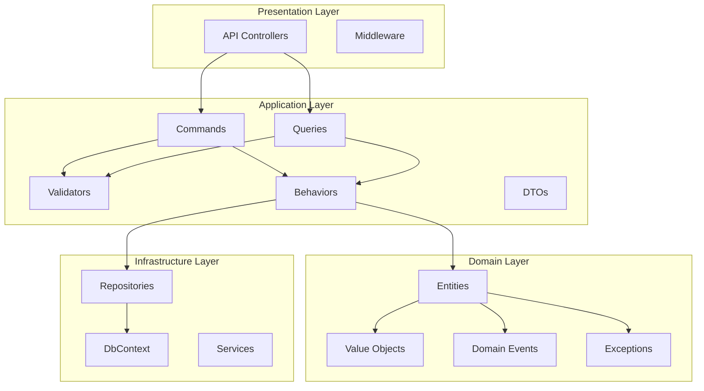
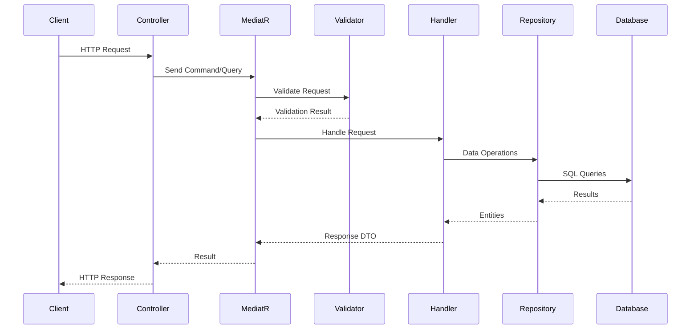

# Financial Transaction API

A production-grade RESTful API for managing financial accounts and transactions, built with .NET 10 following Clean Architecture principles and CQRS pattern.

## Table of Contents

- [Overview](#overview)
- [Architecture](#architecture)
- [Getting Started](#getting-started)
  - [Prerequisites](#prerequisites)
  - [Running with Docker](#running-with-docker)
  - [Running Locally](#running-locally)
- [API Documentation](#api-documentation)
  - [Accounts](#accounts)
  - [Transactions](#transactions)
  - [Health Check](#health-check)
- [Design Decisions](#design-decisions)
- [Testing](#testing)
- [Project Structure](#project-structure)

## Overview

This API provides a complete solution for managing financial accounts and processing transactions with the following features:

- **Account Management**: Create, freeze, unfreeze, and close accounts
- **Transaction Processing**: Deposits, withdrawals, and transfers between accounts
- **Idempotency**: Safe retry mechanism for all transaction operations
- **Audit Trail**: Complete tracking of all changes with timestamps and user information
- **Money Handling**: Precise decimal calculations using banker's rounding

## Architecture

The solution follows **Clean Architecture** principles with clear separation of concerns:



### Layer Responsibilities

| Layer | Responsibility |
|-------|----------------|
| **API** | HTTP endpoints, request/response handling, middleware |
| **Application** | Business logic orchestration, CQRS commands/queries, validation |
| **Domain** | Core business entities, value objects, domain rules |
| **Infrastructure** | Data persistence, external services, repositories |

### Request Flow



## Getting Started

### Prerequisites

- [.NET 10 SDK](https://dotnet.microsoft.com/download/dotnet/10.0)
- [SQL Server](https://www.microsoft.com/en-us/sql-server/sql-server-downloads) (or SQL Server in Docker)
- [Docker](https://www.docker.com/) (optional, for containerized deployment)

### Running with Docker

The project includes a complete Docker setup with SQL Server.

1. **Start the application with Docker Compose:**

```bash
# Build and start all services
docker-compose up -d

# View logs
docker-compose logs -f api

# Stop all services
docker-compose down

# Stop and remove volumes (clean slate)
docker-compose down -v
```

2. **Access the API:**
   - API: http://localhost:5000
   - Swagger UI: http://localhost:5000/swagger
   - Health Check: http://localhost:5000/health

3. **Sample Data:**

   The database is automatically seeded with sample accounts on first run:
   - John Smith (Checking + Savings accounts)
   - Jane Doe (Checking + Investment accounts)
   - Acme Corporation (Business Checking)

   Each account has sample deposits, withdrawals, and transactions for demonstration.

### Running Locally

1. **Clone the repository:**

```bash
git clone https://github.com/pburt-dev/dotnet-financial-api.git
cd dotnet-financial-api
```

2. **Update the connection string** in `src/API/appsettings.Development.json`:

```json
{
  "ConnectionStrings": {
    "DefaultConnection": "Server=localhost;Database=FinancialDb;Trusted_Connection=True;TrustServerCertificate=True"
  }
}
```

3. **Run the API:**

```bash
cd src/API
dotnet run
```

4. **Access the API:**
   - Swagger UI: http://localhost:5169/swagger
   - Health Check: http://localhost:5169/api/health

## API Documentation

### Accounts

| Method | Endpoint | Description |
|--------|----------|-------------|
| `POST` | `/api/accounts` | Create a new account |
| `GET` | `/api/accounts/{id}` | Get account details |
| `GET` | `/api/accounts/{id}/balance` | Get account balance |
| `GET` | `/api/accounts/{id}/transactions` | Get account transactions |
| `POST` | `/api/accounts/{id}/freeze` | Freeze an account |
| `POST` | `/api/accounts/{id}/unfreeze` | Unfreeze an account |
| `POST` | `/api/accounts/{id}/close` | Close an account |

#### Create Account

```http
POST /api/accounts
Content-Type: application/json

{
  "accountHolderName": "John Doe",
  "accountType": "Checking",
  "currencyCode": "USD"
}
```

**Response:** `201 Created`
```json
{
  "id": "3fa85f64-5717-4562-b3fc-2c963f66afa6",
  "accountNumber": "1234-5678-9012",
  "accountHolderName": "John Doe",
  "balance": 0.00,
  "currencyCode": "USD",
  "status": "Active",
  "type": "Checking",
  "openedDate": "2024-01-15T10:30:00Z"
}
```

#### Freeze Account

```http
POST /api/accounts/{id}/freeze
Content-Type: application/json

{
  "reason": "Suspicious activity detected"
}
```

### Transactions

| Method | Endpoint | Description |
|--------|----------|-------------|
| `POST` | `/api/transactions/deposit` | Deposit funds |
| `POST` | `/api/transactions/withdraw` | Withdraw funds |
| `POST` | `/api/transactions/transfer` | Transfer between accounts |
| `GET` | `/api/transactions/{id}` | Get transaction by ID |
| `GET` | `/api/transactions/reference/{ref}` | Get transaction by reference |

#### Deposit

```http
POST /api/transactions/deposit
Content-Type: application/json
Idempotency-Key: unique-key-123

{
  "accountId": "3fa85f64-5717-4562-b3fc-2c963f66afa6",
  "amount": 1000.00,
  "currencyCode": "USD",
  "description": "Initial deposit"
}
```

**Response:** `201 Created`
```json
{
  "id": "7fa85f64-5717-4562-b3fc-2c963f66afa6",
  "transactionReference": "TXN-20240115103000-12345",
  "accountId": "3fa85f64-5717-4562-b3fc-2c963f66afa6",
  "type": "Deposit",
  "amount": 1000.00,
  "currencyCode": "USD",
  "balanceAfter": 1000.00,
  "status": "Completed",
  "description": "Initial deposit",
  "processedAt": "2024-01-15T10:30:00Z"
}
```

#### Transfer

```http
POST /api/transactions/transfer
Content-Type: application/json
Idempotency-Key: transfer-key-456

{
  "sourceAccountId": "3fa85f64-5717-4562-b3fc-2c963f66afa6",
  "destinationAccountId": "8fa85f64-5717-4562-b3fc-2c963f66afa6",
  "amount": 250.00,
  "currencyCode": "USD"
}
```

### Health Check

```http
GET /api/health
```

**Response:** `200 OK`
```json
{
  "status": "healthy",
  "timestamp": "2024-01-15T10:30:00Z"
}
```

### Error Responses

All errors follow a consistent format:

```json
{
  "type": "https://tools.ietf.org/html/rfc7231#section-6.5.1",
  "title": "Bad Request",
  "status": 400,
  "detail": "Validation failed",
  "errors": {
    "Amount": ["Amount must be greater than 0"]
  }
}
```

| Status Code | Description |
|-------------|-------------|
| `400` | Validation error or bad request |
| `404` | Resource not found |
| `422` | Business rule violation (e.g., insufficient funds) |
| `500` | Internal server error |

## Design Decisions

### Clean Architecture

The project follows Clean Architecture to ensure:
- **Independence from frameworks**: Business logic doesn't depend on ASP.NET Core
- **Testability**: Core logic can be tested without UI, database, or external services
- **Independence from UI**: The API layer can be swapped without affecting business logic
- **Independence from database**: SQL Server can be replaced with minimal changes

### CQRS Pattern

Commands and Queries are separated using MediatR:
- **Commands**: Modify state (Create, Update, Delete)
- **Queries**: Read state without side effects
- **Benefits**: Clear separation, easier testing, scalability options

### Money Value Object

Financial calculations use a custom `Money` value object with:
- **Banker's Rounding** (`MidpointRounding.ToEven`): Prevents systematic rounding bias
- **Currency Safety**: Operations validate matching currencies
- **Immutability**: All operations return new instances

```csharp
var amount = Money.USD(100.50m);
var total = amount.Add(Money.USD(25.25m)); // Returns new Money instance
```

### Idempotency

All transaction operations support idempotency keys:
- Prevents duplicate transactions on retry
- Client provides unique key per operation
- Same key returns cached response

### Domain-Driven Design

Key DDD patterns used:
- **Entities**: `Account`, `Transaction` with identity and lifecycle
- **Value Objects**: `Money` for currency amounts
- **Domain Events**: `AccountCreatedEvent`, `TransactionCompletedEvent`
- **Domain Exceptions**: Business rule violations as exceptions

### Audit Trail

All entities inherit from `BaseAuditableEntity`:
- `CreatedAt`, `CreatedBy`: Track creation
- `LastModifiedAt`, `LastModifiedBy`: Track modifications
- Automatically populated by `ApplicationDbContext`

## Testing

The solution includes comprehensive test coverage:

```
tests/
├── Domain.UnitTests/        # 81 tests - Entity and value object tests
├── Application.UnitTests/   # 73 tests - Command/query handler tests
└── API.IntegrationTests/    # 32 tests - End-to-end API tests
```

### Running Tests

```bash
# Run all tests
dotnet test

# Run with coverage
dotnet test --collect:"XPlat Code Coverage"

# Run specific test project
dotnet test tests/Domain.UnitTests
dotnet test tests/Application.UnitTests
dotnet test tests/API.IntegrationTests

# Run tests with detailed output
dotnet test --verbosity normal
```

### Test Categories

| Category | Description | Count |
|----------|-------------|-------|
| Domain Unit Tests | Money calculations, Account operations, Transaction creation | 81 |
| Application Unit Tests | Command handlers, Query handlers, Validators | 73 |
| Integration Tests | Full API endpoint testing with SQLite | 32 |

**Total: 186 tests**

## Project Structure

```
FinancialTransactionAPI/
├── src/
│   ├── API/                          # Presentation layer
│   │   ├── Controllers/              # API endpoints
│   │   ├── Middleware/               # Exception handling
│   │   └── Program.cs                # Application entry point
│   │
│   ├── Application/                  # Application layer
│   │   ├── Accounts/                 # Account commands & queries
│   │   ├── Transactions/             # Transaction commands & queries
│   │   └── Common/                   # Shared behaviors, interfaces
│   │
│   ├── Domain/                       # Domain layer
│   │   ├── Entities/                 # Account, Transaction
│   │   ├── ValueObjects/             # Money
│   │   ├── Enums/                    # Status types
│   │   ├── Events/                   # Domain events
│   │   └── Exceptions/               # Domain exceptions
│   │
│   └── Infrastructure/               # Infrastructure layer
│       ├── Persistence/              # DbContext, Configurations
│       ├── Repositories/             # Data access
│       └── Services/                 # External services
│
├── tests/
│   ├── Domain.UnitTests/
│   ├── Application.UnitTests/
│   └── API.IntegrationTests/
│
├── CLAUDE.md                         # AI assistant context
├── QUICKSTART.md                     # Quick start guide
└── FinancialTransactionAPI.slnx      # Solution file
```

## Technologies

- **.NET 10** - Latest LTS framework
- **Entity Framework Core 10** - ORM with SQL Server
- **MediatR 14** - CQRS and Mediator pattern
- **FluentValidation 12** - Request validation
- **Serilog** - Structured logging
- **xUnit** - Testing framework
- **Moq** - Mocking library
- **Swagger/OpenAPI** - API documentation

## License

This project is licensed under the MIT License.
